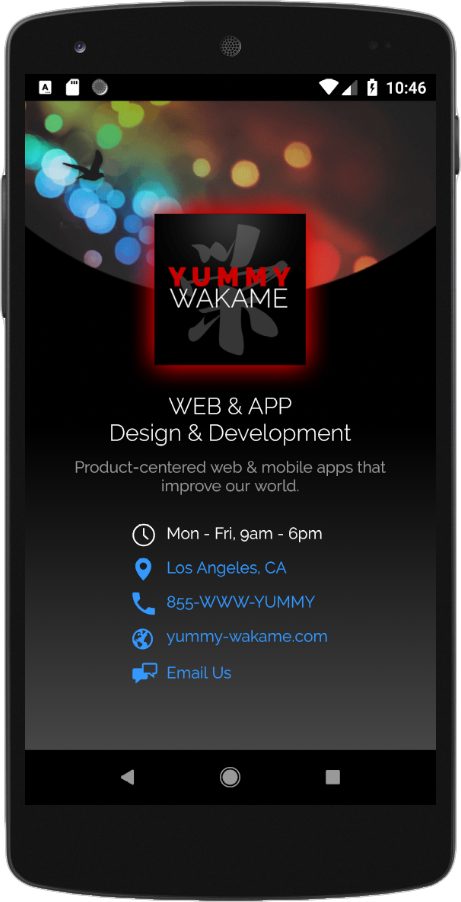

## Grow With Google Android Basics Nanodegree: PROJECT 1
# Single Screen App

Used **API 23: Android 6.0 (Marshmallow)**

### Screenshot From the App:
This app is optimized for portrait but also runs well in landscape

### Follows the Project Rubric
[Udacity Project Rubric (PDF)](./udacity_project_rubric.pdf)

### Features additional items
1. Landscape View
2. Strings stored in strings.xml
3. Preloaded custom font
4. App icon and colourscheme
5. 4 types of intents: Google map location link, call phone number, send email, browser link
6. Background gradient xml resource
